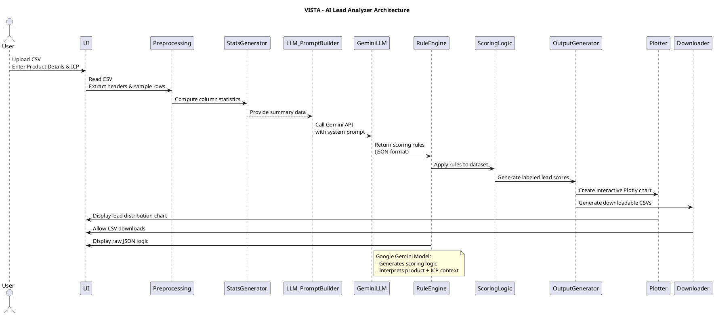

# VISTA: AI-Powered Lead Analyzer

**VISTA** (Value-Integrated Scoring Tool for Analysis) is a smart AI system that helps you identify and qualify sales leads using your product information and a CSV file of customer data. It integrates Google’s Gemini LLM to dynamically build scoring logic and categorize leads into `High`, `Mid`, and `Low` potential.

---

## 🔧 Model Overview

VISTA performs the following tasks:
- Analyzes your product’s benefits and target audience (ICP).
- Processes your uploaded lead dataset.
- Automatically creates a point-based scoring system using Gemini.
- Applies the logic to your dataset.
- Visualizes the results in a lead potential distribution chart.
- Provides downloadable CSV files for each lead category.

---

## 🧠 Model Architecture

Here's how VISTA works internally:



> 💡 You can render this diagram using [PlantUML](https://www.plantuml.com/plantuml) or a compatible tool like VS Code with the PlantUML extension.

---

## 🚀 How to Use VISTA (Example Walkthrough)

### ✅ Step 1: Download the Sample Dataset

Download `synthetic_dataset.csv` from this repository and upload it to the app.

---

### 📝 Step 2: Fill Product Info

**Paste this in the “Product Description” box:**

```
Axis Bank Privilege Credit Card – Product Description

The Axis Bank Privilege Credit Card is a premium card designed to offer a wide range of lifestyle benefits, travel privileges, and exclusive dining experiences.

Key Benefits:
- Earn 10,000 bonus EDGE REWARD Points (worth ₹2000) on annual spends of ₹2.5 lakhs.
- Complimentary domestic airport lounge access (2 per quarter).
- Dining offers via EazyDiner.
- Fuel surcharge refund (up to ₹400/month).
- 10 points per ₹200 spent.
- 12,500 welcome EDGE REWARD Points after first spend.
- Travel insurance and purchase protection.
- Wednesday Offers on Goibibo, Swiggy, Tira.

Fees: ₹1,500 joining & annual fee, 3.75% finance charges.
```

**Paste this in the “Ideal Customer Profile (ICP)” box:**

```
- Age: 18–70 years
- Occupation: Salaried/self-employed with stable income
- Lifestyle: Frequent travelers, diners, and shoppers
- Spending: Annual card spend > ₹2.5 lakh
- Location: India
- Financial mindset: Value-conscious, rewards-focused
```

---

### 🌐 Step 3: Open the App

Launch the app directly here:  
🔗 [https://huggingface.co/spaces/mokorox/Lead_Analyzer_Vista](https://huggingface.co/spaces/mokorox/Lead_Analyzer_Vista)

You’ll see:
- CSV file input
- Text boxes for product and ICP
- Live lead scoring & visualization
- Download buttons for CSVs of each category
- JSON output of AI-generated logic

---

## 📦 Optional: Local Installation

```bash
git clone https://github.com/yourusername/vista.git
cd vista
pip install -r requirements.txt
```

Create a `.env` file and set your Gemini API key:

```
GOOGLE_API_KEY=your_gemini_key_here
```

Then run the app:

```bash
python app.py
```

---

## 📁 File Structure

```
.
├── app.py                      # Main Gradio app
├── synthetic_dataset.csv       # Sample input file
├── requirements.txt
├── README.md
└── docs/
    └── vista_architecture.png  # (Optional) Architecture diagram
```

---

## 📝 License

This project is licensed under the **MIT License**. Feel free to fork, contribute, and build on top of it.

---

## 👨‍💻 Maintainers

- Abhay Kumar – [agkumar2002@gmail.com](mailto:agkumar2002@gmail.com)
- Micronova AI Battalion

---
